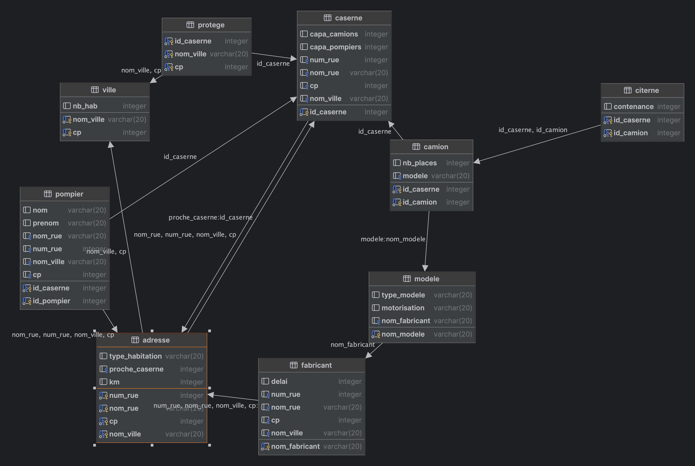

# Les Casernes de Pompiers - Projet M1 BIBS 2023-2024

## Context and Description

This project revolves around the management of fire stations. 

- A fire station is a place where firefighters gather and where trucks are stored. Each fire station has an address, an identification number, a maximum human capacity, and a storage capacity for trucks. Each fire station numbers its trucks and firefighters.

- A firefighter has a number assigned by the station where he is assigned, as well as a name and an address. An address consists of four parts: a street number, a street name, a postal code, and a city name. For each address, we have an estimate of the mileage between this address and the nearest fire station.

- For each city, we know its population. We also know the fire stations that protect a city, and the cities that a fire station protects.

- A truck has a number assigned by the station where it is stored, as well as a maximum number of seats and a model. Among the trucks, we distinguish the tankers for which we also want to know their capacity.

- A truck model is identified by its name (Premium210,...). For each model, we know the type of truck (heavy-fast,...) as well as its engine (210hp,...) and its manufacturer identified by the brand (Renault,...).

- We know for each manufacturer the address of its head office, as well as its average delivery time.

## Database Flowchart

## SQL Queries

1. **What is the number of fire stations?**

2. **Who are the firefighters (identifiers, names, first names) of the fire stations located in Draguignan?**

3. **What are the fire stations protecting both Brignoles and Le Luc?**

4. **Who are the firefighters (identifiers, names, first names) of fire station 3 living more than 5 kms from the "nearest" fire station for their address?**

5. **What is the number of firefighters per fire station?**

6. **What are the fire stations that have reached their maximum human capacity?**

7. **Who are the firefighters who do not work in the city where they live?**

8. **List in descending order the fire stations according to the number of firefighters working there.**

9. **Give for each fire station the total volume of water of its tankers.**

10. **In which fire station(s) is/are the tanker(s) with the largest capacity located?**

## Group Members

|       |
| ----------- |
| Leo Jourdain   |
| Mapathe Faye   |
| Jaffar Gura   |

